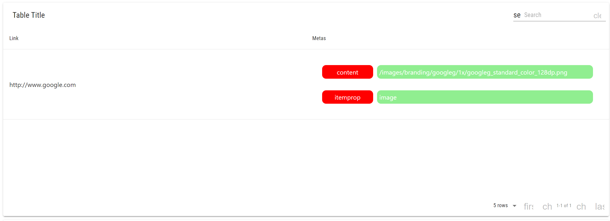
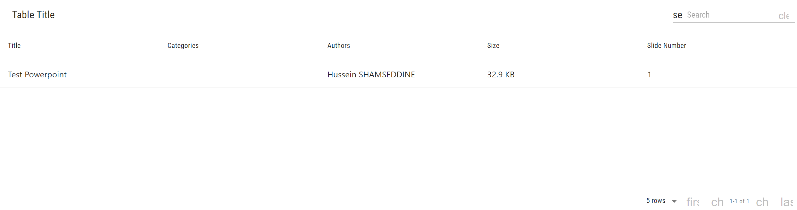
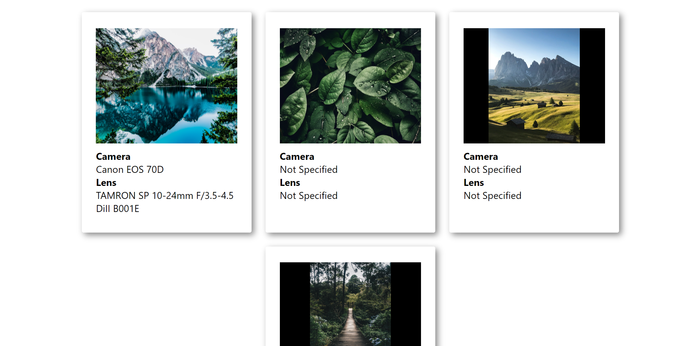

# URL and Powerpoint Metadata Project

## Setup
1. Python 3, Node, and MySQL should be installed on the system and put in the environment variables
2. Open CMD on the root directory
3. Create a MySQL Schema called testdb
4. Enter the command: mysql -u(username) -p(password) testdb < Dump.sql
5. Enter the command: cd server
6. Enter the command: python -m pip install -r requirements.txt
7. Enter the command: python parser.py
8. Open a new CMD instance on the root directory and enter the command: cd client
9. Enter the command: npm install
10. Enter the command: npm start
11. Open the url: http://localhost:3000/

## Description
This project uses MySQL, Python Flask, and ReactJS to extract the metadata from links, powerpoints and images and put them in tables to display, the URLs are inserted through and API endpoint, the Powerpoints are inserted into the powerpoints directory and the images are inserted in the images directory inside the server directory.
It uses the library lxml for the URL parsing, the libraries win32com and python-pptx for the powerpoint parsing, and the library exif for the image parsing. API calls are made through the Javscript axios library.

## Screenshots
### URL Metadata

### Powerpoint Metadata

### Image Metadata
